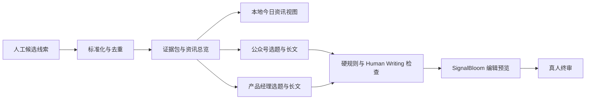

# SignalBloom

> 从信息噪声中找到可信信号，再把它生长成可审核、可分发的内容。

SignalBloom 是一个以 Codex Harness 为执行内核的 AI 行业内容工作流 MVP。它将候选信息整理、去重、事实核验、平台选题、长文写作、配图和质检拆成可追踪阶段，最终交付投稿前编辑包。

当前版本不会登录、写入或发布到微信公众号和人人都是产品经理。终稿仍由真人编辑判断是否发布。

## 现在能做什么

- 读取人工策展的每日候选线索。
- 规范化 URL，聚合重复事件，按来源层级与时效排序。
- 生成资讯总览、事实主张、证据链接和双平台选题。
- 在本地 `review.html` 中提供“今日资讯”视图，按重要度展示本次入选资讯、产品影响、风险边界、证据状态和原始来源。
- 独立生成公众号与产品经理平台长文。
- 执行字数、来源数、图片数、表格、跨平台相似度和 Human Writing 检查。
- 将用户本地稿件和配图组装成 React 投稿前预览页。
- 自动维护本地日期归档，通过同一个入口切换查看历史资讯和文章。
- 将通过研究校验的当日资讯同步到指定的私人飞书群。
- 为每个阶段保留状态、输入哈希、事件流和交付文件哈希。

## 工作流



Codex 处理需要研究、选题和写作的开放任务；Python 处理输入校验、去重、版本、硬规则质检和文件交付。

## 五分钟看到网页

需要 Node.js 20 或更高版本。

```bash
cd review-site
npm ci
npm run dev
```

打开 `http://127.0.0.1:5173`。新克隆的公开仓库会显示不含稿件的空工作台。首页视频是已授权的项目静态资源，不依赖用户电脑或外部视频地址。

## 运行内容流水线

### 环境

- Python 3.9 或更高版本。
- 已安装并登录 Codex CLI。
- Python 业务层不依赖第三方包。
- 只有构建 React 预览页时需要 Node.js 与 npm。

```bash
codex login status
python3 --version
```

### 使用 Codex 生成当日编辑包

执行前，先为当天准备两个文件：

```text
data/seeds/YYYY-MM-DD.json
data/platform_rules/YYYY-MM-DD.json
```

仓库只提供虚构的 `data/seeds/example.json` 和 `data/platform_rules/example.json` 作为结构参考。复制后需要修改日期并填入自己核验过的线索与平台规则。如果当天文件不存在，`run_today.sh` 会立即报错，不会自行编造候选资料。

首次克隆后如果希望流水线交付 React 预览页，请先构建一次前端：

```bash
cd review-site
npm ci
npm run build
cd ..
```

```bash
./scripts/run_today.sh
```

或者显式指定日期、候选资料和平台规则：

```bash
PYTHONPATH=src python3 -m ai_news_agent run \
  --date YYYY-MM-DD \
  --seed data/seeds/YYYY-MM-DD.json \
  --platform-rules data/platform_rules/YYYY-MM-DD.json \
  --provider codex
```

同一日期已有结果时，流水线默认拒绝覆盖。只有确认要从头替换时才使用：

```bash
AI_NEWS_FORCE=1 ./scripts/run_today.sh YYYY-MM-DD
```

### 离线演示

不调用模型，适合先检查流水线是否可运行：

```bash
PYTHONPATH=src python3 -m ai_news_agent run \
  --date 2099-01-01 \
  --seed data/seeds/example.json \
  --provider demo \
  --output /tmp/signal-bloom-demo
```

## 质量门槛

| 检查项 | 当前规则 |
| --- | --- |
| 正文长度 | 每篇至少 6000 个汉字 |
| 关键来源 | 公众号至少 4 个，产品经理稿至少 5 个 |
| 文章配图 | 总数 4–5 张，每个平台至少 2 张 |
| 表格 | 禁止 Markdown 表格 |
| 失败处理 | 先按证据门槛阻断；当材料足够但稿件触发机械规则时，自动进行一次证据约束返修，仍失败才输出 `blocked` |
| 可追溯性 | 交付文件进入 Manifest 并记录 SHA-256 |

运行检查：

```bash
PYTHONPATH=src python3 -m unittest discover -s tests -v
cd review-site && npm run build
```

## 输出结构

每日结果写入 `outputs/YYYY-MM-DD/`。这些文件是本地业务产物，默认不提交到 Git。`outputs/index.html`、`outputs/review.html` 和 `outputs/archive.json` 只记录本地入口与可用日期，同样不会提交。

```text
outputs/YYYY-MM-DD/
├── manifest.json
├── normalized_items.json
├── research_bundle.json  # “今日资讯”视图的唯一数据源
├── daily_digest.md
├── wechat_article.md
├── woshipm_article.md
├── qa_report.json
├── feishu_delivery.json # 只在成功同步飞书后生成
├── review.html           # 今日资讯、双平台文章与质量门
├── images/
└── events/
```

### 查看本地历史日报

```bash
./scripts/serve_review.sh
```

固定入口是 `http://127.0.0.1:4173/review.html`。它会打开最新一期，导航栏中的“历史日期”可以切换到昨天或更早的资讯与两篇文章。每日流水线结束后会自动刷新日期索引，不需要复制文章或维护数据库。

也可以直接指定一期：

```bash
./scripts/serve_review.sh YYYY-MM-DD
```

编辑修改两篇 `*.final.md` 后，可以重新执行质检并刷新预览页：

```bash
PYTHONPATH=src python3 scripts/recheck_output.py outputs/YYYY-MM-DD --build-preview
```

`recheck_output.py` 会默认查找 `~/.codex/skills/human-writing/scripts/check_prose.py`。该个人 Skill 不随仓库分发；新环境需要自行安装 Human Writing Skill，或通过 `--prose-checker /absolute/path/to/check_prose.py` 指定兼容检查器。检查器缺失时任务会报错，避免把未检查稿件标记为通过。

## 同步到私人飞书群

第一版只同步“今日资讯”，不会同步两篇平台文章、配图、Prompt 或 Codex 日志。飞书中收到一条富文本日报，包含总览、全部入选资讯、产品判断、风险边界、核验状态和原始来源。

飞书自建应用需要开启机器人能力，并至少拥有以下应用身份权限：

- 获取群组信息 `im:chat:readonly`
- 以应用身份发消息 `im:message:send_as_bot`

发布应用后，在飞书桌面客户端或手机端将机器人加入目标私人群。飞书网页版可能只显示群机器人说明，不显示“添加机器人”按钮。

将本地配置模板复制为 `.env`，再填入自己的 App ID 和 App Secret：

```bash
cp .env.example .env
```

`.env` 已被 Git 忽略。不要把真实 App Secret 发到聊天、写进代码或提交到仓库。

先只校验当天结果，不连接飞书：

```bash
PYTHONPATH=src python3 -m ai_news_agent sync-feishu \
  --output outputs/YYYY-MM-DD \
  --dry-run
```

确认无误后正式同步：

```bash
PYTHONPATH=src python3 -m ai_news_agent sync-feishu \
  --output outputs/YYYY-MM-DD
```

命令会按群名称精确查找机器人所在群。成功后在当日输出目录写入私有回执 `feishu_delivery.json`；同一消息日常重复运行会按回执与飞书 UUID 跳过。投递还会在回执检查、发送和写入最终回执之间持有跨进程锁，因此 Codex 备份任务与 macOS `launchd` 同时触发时只会有一个发送者。若进程恰好在发送与回执确认之间中断，命令会停止自动重试，要求先到目标群人工确认，避免盲目重发。

飞书同步只对“今日资讯”本身设门禁。`qa_report.json` 的 `research.errors` 必须为空，且当前 `research_bundle.json` 的 SHA-256 必须与 Manifest 中已质检的版本一致；若 Manifest 记录了 QA 报告哈希，也必须与当前报告一致。公众号、人人都是产品经理文章及 Human Writing 硬检查属于本地编辑交付，不会阻断已通过研究核验的资讯日报。研究错误或版本哈希不一致时，命令仍会在本地拒绝发送，不能手工改状态绕过门禁。

当前用户环境中的 Codex 定时任务在 06:00 做资讯准备，并在 08:00 做一次迟到补准备；投递在 09:00 做主检查，并在 11:00、13:00 和 15:00 做迟到补投检查。准备任务晚于主检查完成时，后续检查会重新核对当天文件和幂等回执；如果研究仍未通过，则继续阻塞，不会回退到旧日期或演示内容。

后台投递使用 `scripts/scheduled_feishu_runner.py` 作为安装模板。它会被复制到当前用户目录之外，固定只处理上海时区当天的输出，先执行本地 dry-run，再发送研究核验通过的日报；runner 会校验随附 `feishu.py` 的 SHA-256，拒绝命令行参数，也不会打印凭证或私人 ID。Codex 的全局规则只允许这一个固定 runner 在后台访问网络，项目源码本身仍不能借此直接联网。修改规则后需要重启 Codex，才能让后续计划任务加载新规则。

当前 macOS 还安装了一个同样指向该 runner 的用户级 `launchd` 任务，在 09:00、11:00、13:00、15:00 各检查一次。它与 Codex 投递任务共享同一份幂等回执，任一条链路成功后另一条只会跳过，不会重复发消息。电脑需要保持开机并处于已登录用户会话；准备阶段仍依赖 Codex 计划任务运行。

每天 15:10 还有一个独立的本地 watchdog 检查当天 `feishu_delivery.json`。如果回执不是当天的 `succeeded`，它会弹出 macOS 通知并在日志中记录异常；它不会回退发送旧日期或演示内容。watchdog 与 runner 一样安装在用户目录之外，安装配置中的 `project_dir` 必须是当前电脑上的绝对路径，换电脑时需要重新安装或改配置。电脑关机、未登录或系统通知被关闭时，macOS 本地通知无法显示；这属于本地调度的运行边界。

## 数据隐私边界

公开仓库只保存功能代码、Schema、Prompt、虚构结构示例和已授权的 UI 素材。以下内容默认只属于运行它的当前用户：

- 每日候选线索与平台规则快照。
- 研究证据包、资讯总览和选题。
- 平台稿件、配图、质检报告与预览包。
- Manifest、事件流、日志和编辑批注。
- 飞书凭据、目标群信息和投递回执。

这些文件被 `.gitignore` 阻止进入版本库。不要使用 `git add -f` 强制上传。“今日资讯”结果同样属于用户本地生成内容；公开仓库不包含 `research_bundle.json`、用户资讯结果或内置真实样例。预览构建也不会把用户内容回写到 `review-site/public/`。

## 项目结构

```text
configs/       来源、平台与质量门槛
data/          本地候选线索、平台规则快照与虚构结构示例
docs/          PRD 与 Codex Harness 选型评估
prompts/       研究、公众号和产品经理提示词
review-site/   React + TypeScript + Vite 编辑预览
schemas/       模型结构化输出约束
scripts/       日常运行、复检和本地预览脚本
src/           确定性 Python 流水线
tests/         离线单元测试
```

## 当前边界

- AIHOT、Notion 日报和研报站点已进入来源策略，但 V0.1 的正式输入仍是人工策展的种子 JSON。
- “今日资讯”展示本次候选输入经去重、筛选和证据核验后的结果，页面本身不会再发起一轮联网搜索。
- 仓库本身不内置无人值守爬虫、业务数据库或告警；当前用户环境通过 Codex 定时任务触发本地准备与飞书投递，任务配置不随公开仓库分发。
- 当前不会把文章写入任何内容平台。
- 配图生成尚未接入每日 Python 流水线。

## 文档

- [PRD V0.1](docs/PRD-V0.1.md)
- [Codex Harness 选型评估](docs/CODEX-HARNESS-ASSESSMENT.md)

## 部署

`review-site` 是标准 Vite 静态站点。执行 `npm run build` 后，可将 `review-site/dist/` 部署到 GitHub Pages、Cloudflare Pages 或其他静态托管服务。公开仓库构建出的是空工作台，不包含用户稿件、配图或研究结果。

花朵视频已由项目所有者确认可以公开使用。如果主动将某个用户的本地编辑包部署到公网，就等于主动公开其中内容，必须先得到该用户确认并完成素材权利检查。当前仓库不自动开启 GitHub Pages。

## 安全说明

- 候选网页内容一律按不可信外部输入处理。
- 不要将 Codex、GitHub 或内容平台凭据写入种子文件、提示词、日志或输出目录。
- `outputs/`、按日期的 seed 和平台规则可能包含私有业务内容，默认不进入 Git。

## 许可说明

本项目采用 [MIT License](LICENSE)。你可以自由使用、复制、修改、合并、发布、分发、再许可和销售本项目代码及其衍生作品，但需要保留原许可证和版权声明。项目中的每日资讯、文章、配图、飞书凭据和其他用户生成内容不属于公开代码许可范围，仍按“数据隐私边界”处理。
